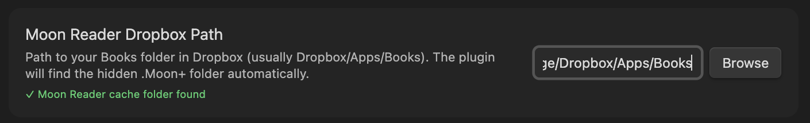

# MoonSync

Sync your reading highlights, notes, and progress from Moon+ Reader to **Obsidian** and **[Hardcover.app](https://hardcover.app)**.

> [!NOTE]
> MoonSync is a **desktop-only** plugin. It requires access to Moon Reader's sync folder on disk (via Dropbox, WebDAV, or FTP), which is not available on mobile.

## Features

- **Obsidian Sync** — Automatically create and update book notes with highlights, reading progress, covers, and metadata
- **Hardcover Sync** — Push reading status and progress to [Hardcover.app](https://hardcover.app) so your library stays up to date across platforms
- **Rich Metadata** — Book covers, descriptions, genres, series info, reading time, and ratings — sourced from [Hardcover](https://hardcover.app) (recommended), Moon Reader's sync data, or Google Books and Open Library as a fallback
- **Library Index** — Auto-generated index with cover collage, stats, and an Obsidian Bases database view
- **Highlight Colors** — Preserve Moon Reader highlight colors as styled callouts
- **File Watcher** — Automatically sync when Moon Reader cache files change (ideal for always-on servers)
- **Smart Updates** — Only syncs when highlights or progress actually change

## How It Works

Moon Reader syncs your reading data to the cloud (Dropbox, WebDAV, or FTP). MoonSync reads that data and creates rich book notes in Obsidian. If Hardcover sync is enabled, it also updates your reading status there.

**Data flow:** Moon Reader → Cloud Sync → MoonSync → Obsidian + Hardcover

### Sync My Shelf (Recommended)

For the best experience, enable **"Sync books across devices"** (also called "Sync my shelf") in Moon Reader's sync settings. This creates a `books.sync` file that contains your full Moon Reader library with rich metadata.

When enabled, MoonSync gets the following data locally from your sync folder:

| Data | Source |
|---|---|
| Book title | Epub/PDF internal metadata (more accurate than filename) |
| Author | Epub/PDF internal metadata |
| Description | Epub/PDF internal metadata |
| Genres | Moon Reader category tags |
| Series & series number | Moon Reader category tags |
| Reading time | Moon Reader backup statistics |
| Words read | Moon Reader backup statistics |
| Book covers | Moon Reader extracted covers |
| Reading progress | Moon Reader cache files |
| Highlights & notes | Moon Reader cache files |
| Favorite status | Moon Reader shelf data |
| Date added | Moon Reader shelf data |

This is the recommended way to use MoonSync — syncing is faster since less data needs to be fetched from the network.

However, ebook files often contain poorly formatted or incorrect metadata (wrong titles, missing authors, inconsistent formatting). MoonSync uses external metadata providers — **[Hardcover](https://hardcover.app)** (recommended), **Google Books**, or **Open Library** — to cross-reference and correct this data, ensuring your book notes have clean, accurate titles, descriptions, covers, and genres.

### Without Sync My Shelf

If "Sync my shelf" is not enabled, MoonSync falls back to discovering books from Moon Reader's cache files (`.an` and `.po` files). All metadata is fetched from **[Hardcover](https://hardcover.app)** (if enabled, recommended), **Google Books**, or **Open Library**.

### What Gets Synced

| To Obsidian | To Hardcover |
|---|---|
| Book highlights with timestamps and colors | Reading status (Want to Read, Currently Reading, Read) |
| Reading progress (percentage and chapter) | Reading progress (page count) |
| Book metadata (title, author, publisher, genres, series) | Book matched by title/author |
| Book covers and descriptions | |
| Reading time and statistics | |

### Requirements

- [Moon Reader](https://play.google.com/store/apps/details?id=com.flyersoft.moonreader)
- [Dropbox Desktop App](https://www.dropbox.com/desktop) or mounted WebDAV/FTP server
- [Obsidian](https://obsidian.md/download)
- [BRAT](https://github.com/TfTHacker/obsidian42-brat)

## Installation
MoonSync can be installed either via the BRAT Plugin (recommended) or via a custom install.

*This plugin has been submitted as a community plugin and is pending review*

### BRAT Installation
Using BRAT is the recommended, and easiest, way to install custom Obsidian plugins that are not available in the Obsidian Community Store.

1. Install BRAT via community plugins.
2. Open BRAT and select "Add Beta Plugin"
3. Paste `https://github.com/titandrive/Obsidian-MoonSync` into the text bar
4. Click "Add Plugin"
5. Configure MoonSync (see below)

MoonSync is now installed and BRAT will automatically keep track of updates for you

### Custom Installation
1. Browse to MoonSync [Releases](https://github.com/titandrive/Obsidian-MoonSync/releases)
2. Download the latest release
3. Extract the release and copy it to your obsidian vault: `.../MyVault/.obsidian/plugins/MoonSync`
4. Restart Obsidian
5. Enable MoonSync in Settings/Community Plugins
6. Configure MoonSync (see below)

## How to Sync

### Configuring Automatic Sync
Once MoonSync is installed, you will need to configure it before it can complete its first sync.
1. Open up Settings → Community Plugins → MoonSync
2. Enable MoonSync
3. Click on the settings Cog to open up MoonSync settings.
4. Under configuration, browse to your Moon Reader sync folder on your computer. For Dropbox this is typically `.../Dropbox/Apps/Books/`. For WebDAV/FTP, point it to your mounted server. MoonSync will validate that it can find the correct cache files.
5. Press Sync

By default, MoonSync will now Sync your books anytime you open Obsidian. You can also trigger a manual sync at anytime via the ribbon menu shortcut or Command Palette (see below).

### Setting Up Moon Reader for Best Results

For the richest and most accurate metadata, configure Moon Reader as follows:

1. **Enable cloud sync** — In Moon Reader, go to Misc → Sync to cloud and configure your sync provider (Dropbox, WebDAV, or FTP)
2. **Enable "Sync books across devices"** — This is the key setting. It creates the `books.sync` file that MoonSync uses for offline metadata. Found in Misc → Sync to cloud → Sync books across devices.
3. **Enable "Track books without highlights"** in MoonSync settings — This allows MoonSync to discover all books in your library, not just ones with highlights.

With all three enabled, every book in your Moon Reader library will appear in Obsidian with full metadata, even if you haven't made any highlights yet.

### Setting Up Hardcover

MoonSync integrates with [Hardcover.app](https://hardcover.app), a modern book tracking platform. Even if you don't use Hardcover to track your reading, enabling it is **recommended** as it provides significantly better metadata than Google Books or Open Library — including more accurate titles, descriptions, genres, and cover images.

1. Create a [Hardcover](https://hardcover.app) account if you don't have one
2. Go to the [API Getting Started](https://docs.hardcover.app/api/getting-started/) page and get your bearer token
3. In MoonSync settings, go to the **Hardcover** tab
4. Enable Hardcover and paste your API token
5. Click **Test** to verify the connection

#### Metadata Only (No Progress Sync)

If you just want better metadata without syncing your reading progress to Hardcover, enable Hardcover and paste your token but turn **off** "Sync reading progress." MoonSync will use Hardcover as the primary metadata source for book titles, descriptions, genres, covers, and more — without updating your Hardcover library.

#### With Progress Sync

With "Sync reading progress" enabled, MoonSync also updates your Hardcover library after each sync:
- **0% progress** → Want to Read
- **1–98% progress** → Currently Reading
- **99%+ progress** → Read
- Books without progress data are skipped

MoonSync searches Hardcover by title to find matching books. Once matched, the `hardcover_id` is saved to your note's frontmatter so future syncs are instant. If the wrong book is matched, use the **Update Hardcover Link** command to correct it.

#### My Notes
Every book note contains a section called "My Notes". You can add your own notes here such as your thoughts on the book. As your reading progresses, MoonSync will continue to update your reading progress and add new highlights. Anything added in "My Notes" will be preserved.

#### Typical Sync Workflow
1. Read book and make highlights in Moon Reader
2. Once you are finished reading, sync your progress to the cloud. Depending on your app settings, you may need to trigger this manually.
3. Trigger MoonSync by opening Obsidian or clicking the ribbon  button.
4. Your highlights and reading progress should immediately become available.

#### FTP/WebDAV Support
Although Dropbox is the easiest way to sync your notes, Moon Reader also supports syncing via WebDAV or FTP. This requires you to have your own WebDAV or FTP server and is therefore a bit more involved to get working. MoonSync has been tested and works perfectly using a selfhosted server such as [SFTPGo](https://github.com/drakkan/sftpgo).

### Manual Book Sync
If you do not want to use automatic syncing, MoonSync also supports manual exports.

First, export your notes:
1. While viewing a book in Moon Reader, open up the Bookmarks bar. You should see all of your existing notes and highlights
2. Click the share button then "Share notes & highlights (TXT)"
3. Share the notes to Obsidian.
*Note: It does not matter where the note is created. It does not need to be made in the /books directory.*
4. Choose a note in Obsidian to save it to.

Once you have exported your notes, you can import it using the command palette:
1. Open the note that you just created.
2. While viewing the note, open the Command Palette (`Cmd/Ctrl + P`)
3. Choose `MoonSync: Import Note`
4. MoonSync will automatically create a new book note, find matching metadata, and update the index & base files.

## Custom Books
Sometimes you may have books you wish to keep track of that you read outside of Moon Reader. MoonSync supports creating custom books that can be tracked in the same manner.

To create a custom book,
1. Open the Command Palette and select `MoonSync: Create Book Note`.
2. Search for your book in the search prompt
3. Select your book

MoonSync will import all available metadata and create a new book note in `/Books`. You can then enter your favorite highlights and notes!

If in the future, you begin reading that same book in Moon Reader, and make more highlights, MoonSync will intelligently update this note so you won't lose any of your past highlights.

## Command Palette

MoonSync provides several commands accessible via the command palette (`Cmd/Ctrl + P`):

### Sync Now
Synchronize all books from Moon Reader. Only updates notes when highlights or progress have changed.

### Import Note
Import highlights from a manual Moon Reader export. Useful for one-time imports or when cloud sync isn't available.

### Create Book Note
Create a new book note. The command opens up a search modal to find the book via Google Books. It then creates a new note for it.

### Fetch Book Cover
Re-fetch the cover image for the current note. Useful if a cover is missing or you have a different edition you prefer. Covers can be selected via search or by importing from a url.

### Fetch Book Metadata
Replace all metadata for the current note by selecting from search results. Updates title, author, cover, description, publisher, page count, genres, series, and language. Also sets `custom_metadata: true` to prevent future syncs from overwriting your selection.

### Update Hardcover Link
Manually set the Hardcover book for the current note. Paste a Hardcover URL (e.g. `https://hardcover.app/books/the-man-in-the-high-castle`) and MoonSync will update the `hardcover_id` and `hardcover_url` in frontmatter and immediately sync your reading progress. Useful when the automatic match picks the wrong book or edition. This command only appears when Hardcover sync is enabled.

## Settings
MoonSync has a variety of settings to customize how the plugin works. Default settings should work for most readers but are available so you can tailor it to your preferences.

### Configuration Tab
These settings configure how MoonSync works.
#### Configuration
- **Moon Reader Sync Path** - path to your Moon Reader sync folder (Dropbox, mounted WebDAV, or FTP). For Dropbox this is typically `.../Dropbox/Apps/Books`. The plugin automatically looks for the hidden `.Moon+/Cache` folder inside.
- **Output Folder** - Where your booknotes will be stored. Default: `/Books`

#### Sync Options
- **Sync Now** - Trigger manual sync
- **Sync on Startup** - Automatically sync when Obsidian starts
- **Show Ribbon Icon** - Show sync button in the ribbon menu
- **Track Books Without Highlights** - Track all books in your Moon Reader library, not just ones with highlights. When "Sync my shelf" is enabled in Moon Reader, this discovers your entire library from the sync data. Otherwise, it tracks books that have reading progress but no highlights yet.
- **Automatic Sync** - Automatically sync when Moon Reader cache files are updated. Best suited when Obsidian is hosted on an always-on server. Uses a 3-second debounce to batch rapid file writes.

#### Maintenance
- **Force Resync All Books** - Clears the metadata cache and resyncs all books with the latest data. Useful after plugin updates or if you want to regenerate all notes with the latest enrichment data.

### Content Tab
These settings configure what information is shown in your book notes.

#### Note Content
- **Show Description** - Include book description (from sync data or Google Books/Open Library)
- **Show Reading Progress** - Include progress percentage, current chapter, and date last read
- **Show Highlight Colors** - Use different callout styles based on highlight color
- **Show Book Covers** - Include book covers

Note: Enabling/disabling these options will show/hide the feature in real time.

#### Highlight Sorting
- **Sort Order** - Control how highlights are ordered in your book notes: by position in book (first to last or last to first) or by date added (oldest first or newest first). Default: Position in book (first to last).
- **Regenerate All Notes** - Force all book notes to be rewritten with the current settings. Useful after changing the sort order.

### Index & Base Tab
MoonSync automatically generates an index and base note to give you different way to visualize your data. These settings allow you to customize your index and base.

#### Library Index

- **Generate Library Index** - Control whether MoonSync will generate an index. MoonSync, by default, will generate an index upon first sync. Disabling this will delete the index file.
- **Index Note Title** - By default, the index note is titled `1. Index Note` so that it stays at the top of the list. You can change the name here.
- **Show Cover Collage** - Show or hide the cover collage
- **Cover Collage Limit** - Control how many covers show in the collage. Setting it to `0` will show covers for all books in the index.
- **Cover Collage Sort** - Controls whether the cover collage is sorted alphabetically or chronologically.

#### Obsidian Bases
- **Generate Base File** - Control whether MoonSync will generate a Base file. MoonSync, by default, will generate a base upon first sync. Disabling this will delete the base file.
- **Base File Name** - By default, the base note is titled `2. Base` so that it stays at the top of the list. You can change the name here.

### Hardcover Tab
- **Enable Hardcover** - Use Hardcover as a metadata source and optionally sync reading progress. Recommended for all users — provides better titles, descriptions, genres, and covers than Google Books or Open Library
- **API Token** - Your Hardcover bearer token
- **Test Connection** - Verify your token is working
- **Sync Reading Progress** - When enabled, MoonSync pushes your reading status and progress to your Hardcover library after each sync. Turn this off if you only want Hardcover for metadata

### About the Index and Base Notes

#### Library Index

When enabled, MoonSync generates an index file titled `1. Library Index.md` that shows the following:

- Visual grid of book covers. Clicking on a cover will take you to the associated note.
- Summary statistics: total books, highlights, notes, average progress
- List of all books with author, progress, and highlight counts

The index updates automatically after each sync.

#### Base Note
The base note provides a database-like view of your book data.

The base note provides a Gallery view that shows each cover in your library. Clicking on a cover will take you to the associated link.

It also provides a library view that shows a breakdown of the following statistics per book:
- Title (file name)
- Author
- Highlights count
- Progress percentage
- Notes count
- Manual note indicator
- Last read date
- Last synced date
- Genres
- Series
- Reading time
- Page count
- Publisher
- Published date
- Language

## FAQ

Do I need a Hardcover account?

No, but it's recommended. Hardcover provides significantly better metadata (titles, descriptions, genres, covers) than the fallback sources (Google Books, Open Library). You can use it for metadata only without syncing your reading progress.

Does MoonSync work on mobile?

Not currently. MoonSync requires access to Moon Reader's sync folder on disk (via Dropbox, WebDAV, or FTP), which is only available on desktop.

Does MoonSync work with Moon Reader Free or only Pro?

Cloud sync (Dropbox, WebDAV, FTP) is a Pro-only feature, so automatic syncing requires Moon Reader Pro. With the free version, you can still use MoonSync's manual export/import workflow — share your highlights as text from Moon Reader and import them via the "Import Note" command.

Can I use MoonSync with Kindle or other e-readers?

No. MoonSync is designed specifically for Moon Reader's sync format. It reads `.an`, `.po`, and `books.sync` files that are unique to Moon Reader.

Does MoonSync support PDFs?

Yes. Moon Reader supports PDFs, and MoonSync will pick up highlights and progress from PDF files just like EPUBs.

Will MoonSync overwrite my notes?

MoonSync preserves anything you write in the "My Notes" section of each book note. It only updates metadata, highlights, and progress. If you manually set metadata via "Fetch Book Metadata," it sets `custom_metadata: true` to prevent future syncs from overwriting your selection.

What happens if I delete a highlight in Moon Reader?

MoonSync reflects your Moon Reader data — if you delete a highlight in Moon Reader and sync, it will be removed from your Obsidian note as well.

What happens if I delete a book or its sync data from Moon Reader?

Nothing. Your Obsidian book notes are independent files — MoonSync will never delete or modify them just because the source data is gone. They remain in your vault as-is.

How often does MoonSync sync?

By default, MoonSync syncs once when Obsidian starts. You can also trigger a manual sync anytime via the ribbon icon or command palette. If you enable "Automatic Sync," it watches your sync folder for changes and syncs within a few seconds of Moon Reader updating its cache files.

Can I customize the book note format?

You can toggle individual sections on or off (description, progress, covers, highlight colors) and change the highlight sort order in settings. Full template customization is not currently supported.

How does Hardcover progress sync work?

Whenever your progress changes in Moon Reader, and Hardcover sync is enabled, MoonSync will push that to Hardcover. Your progress (percent and page number) will therefore be reflected in Hardcover. It will also update the reading status of books (Currently Reading, Read) automatically. When a book changes from 0%, it will update the status from Want to Read to Currently Reading. When the progress gets to 99%, the book will be marked as Read. 

## Privacy & Security

- **Read-only access**: MoonSync only reads from your sync folder. It never modifies your Moon Reader data.
- **Local processing**: All data stays on your machine. Highlights and reading progress are read locally from your sync folder. Metadata and covers are fetched from external APIs (Hardcover, Google Books, Open Library) and cached locally.
- **Caching**: API responses are cached locally to minimize external requests.

## Troubleshooting

### "No annotation files found"
- Ensure Moon Reader has cloud sync enabled
- Check that highlights exist and have synced to your sync folder
- Depending on your device, and settings, you may have to trigger a manual sync in Moon Reader (Sync to Cloud)
- Verify the path points to the folder containing `.Moon+` (e.g. `Dropbox/Apps/Books` or your mounted WebDAV/FTP server)

### Books not appearing
- Enable "Track books without highlights" in MoonSync settings
- Enable "Sync books across devices" in Moon Reader's sync settings for full library discovery
- If using "Sync my shelf", make sure you've synced at least once from Moon Reader after enabling it

### Progress not showing
- Progress requires a `.po` file for the book
- Open the book in Moon Reader and let it sync

### Covers/descriptions not loading
- Check your internet connection (only needed if "Sync my shelf" is not enabled)
- Some books (especially new releases) may not be in Google Books/Open Library
- Use "Fetch Book Cover" or "Fetch Book Metadata" to manually search for the correct edition

### Wrong book metadata
- Use "Fetch Book Metadata" command to search and select the correct book
- This sets `custom_metadata: true` to prevent future syncs from changing it

### Hardcover matching wrong book
- Use the "Update Hardcover Link" command to paste the correct Hardcover URL
- This saves the `hardcover_id` to your note so future syncs use the correct book

## AI Disclosure
This plugin was made with the assistance of Claude Code.

## License

MIT
